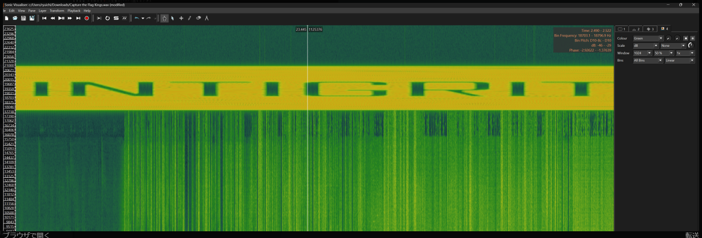

# 解き方
pcap解析問題

pcapを見るとsmb2でwavデータがやり取りされている。
「ファイル」→「オブジェクトをエクスポート」→「SMB」でwavデータを抽出した。

(https://blog.hamayanhamayan.com/entry/2022/12/14/234257)  
を参考にhttps://sonicvisualiser.org/　を使用して、スペクトラムを作成したところフラグらしき文字列が出てきた。

INTIGRITI{hidden_in_music_1337}

