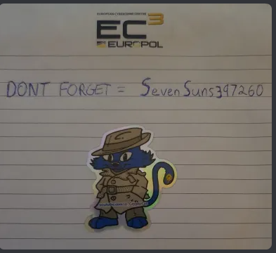
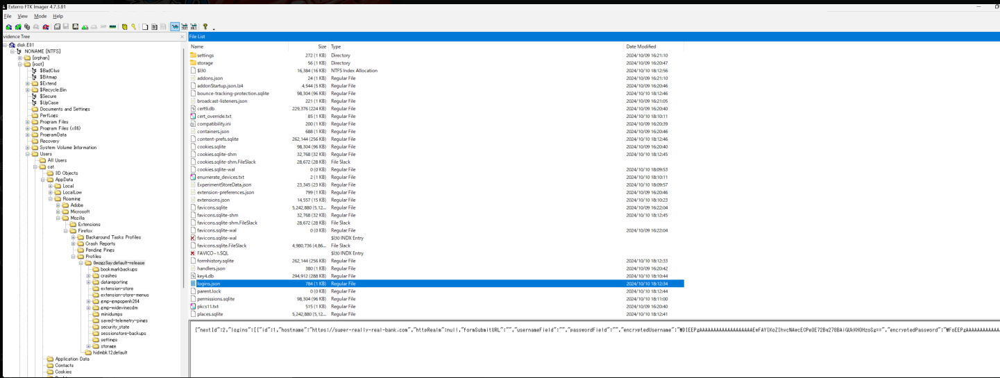
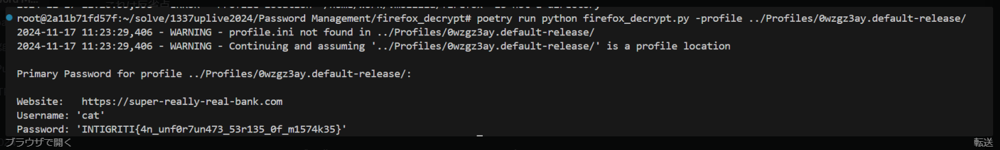

## 解き方
1. FTK Imagerを使用して、削除済データから何かしらのパスワードを見つけた。  

2. AutoSpyで解析すると、firefoxでsuper-really-real-bank.comにアクセスしていることがわかった。 
3. firefoxのキャッシュデータに、super-really-real-bank.comにユーザ名とパスワードが含まれていることが分かった。
4. firefoxのプロファイルをfirefox_decryptを使用して復号するとフラグを見つけた。

