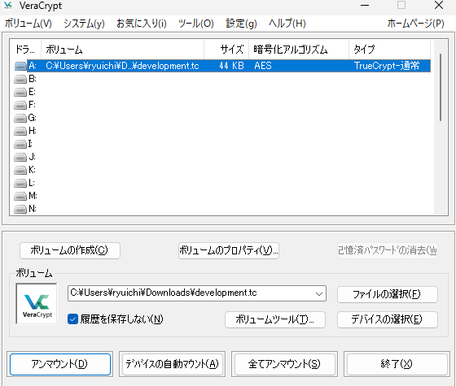

## writeup
初めに、volatility3でファイルスキャンすると、backup_development.zipという開発途中の成果物がメモリに含まれていることがわかる。

```python
root@568cfbfbdf97:~/solve/hackthebox/Forensic/TrueSecrets# vol3 -f TrueSecrets.raw windows.filescan.FileScan | grep zip
0x483038:  100.0\Windows\System32\zipfldr.dllfinished                        
0x28acb78       \Windows\System32\en-US\zipfldr.dll.mui
0x95796b0       \Windows\System32\en-US\zipfldr.dll.mui
0xbbf6158       \Users\IEUser\Documents\backup_development.zip
0xc4aef80       \Program Files\7-Zip\7-zip.dll
```

続いて、次のコマンドを入力して、メモリからbackup_development.zipをサルページする。

```python
root@568cfbfbdf97:~/solve/hackthebox/Forensic/TrueSecrets# vol3 -f TrueSecrets.raw windows.dumpfiles --physaddr 0xbbf6158 
Volatility 3 Framework 2.11.0
Progress:  100.00               PDB scanning finished                        
Cache   FileObject      FileName        Result

DataSectionObject       0xbbf6158       backup_development.zip  file.0xbbf6158.0x839339d0.DataSectionObject.backup_development.zip.dat
SharedCacheMap  0xbbf6158       backup_development.zip  file.0xbbf6158.0x9185db40.SharedCacheMap.backup_development.zip.vacb
```

次に、unzipするために下記コマンドを入力する。

```python
root@568cfbfbdf97:~/solve/hackthebox/Forensic/TrueSecrets# unzip file.0xbbf6158.0x839339d0.DataSectionObject.backup_development.zip.dat 
Archive:  file.0xbbf6158.0x839339d0.DataSectionObject.backup_development.zip.dat
 extracting: development.tc    
```

拡張子を調べたりchatgptに淘汰りしたところ、どうもtruecryptという方法で暗号化されているらしい.  
暗号化するためのパスワードも```truesecrets.raw```に含まれているらしいが、昔のやつのため、volnability2にしかその機能がない。 
下記コマンドをたたいてみると、X2Hk2XbEJqWYsh8VdbSYg6WpG9g7らしい。
```python
root@568cfbfbdf97:~/solve/hackthebox/Forensic/TrueSecrets# vol2 -f TrueSecrets.raw  --profile=Win7SP1x86_23418 truecryptpassphrase
Volatility Foundation Volatility Framework 2.6.1
Found at 0x89ebf064 length 28: X2Hk2XbEJqWYsh8VdbSYg6WpG9g7
```

パスワードとrawデータがわかったところで、複合する必要がある。  
truecrypto自体は昔の暗号化ツールであり、なんかtruecryptoをインストールするのはこわかったので、
veracryptoを使用した。ただし、veracryptのバージョンは最新ではなく、1.25.9を使用した。
これは、最新のVeracryptにはTrueCryptを復号する機能が廃止されたためである。



これをマウントすると、logファイルと一つのソースコードが見つかる。

ソースコードを見る限り、外部からファイルを受信して、それをDESで暗号化して、それをbase64変換する機能を持つことがわかる。なお、暗号化に必要なパスワードとIVはハードコーディングされている。  
また、logファイルを見る限り、先述のソースコードで暗号化されたファイルだと思われる。  

base64は可逆、DESは、パスワードとIVが判明しているため、複合可能である。  
そこで、これらのログファイルを復号する処理をPythonで書いて実行したところ、 
flagが見つかった。